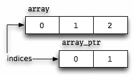
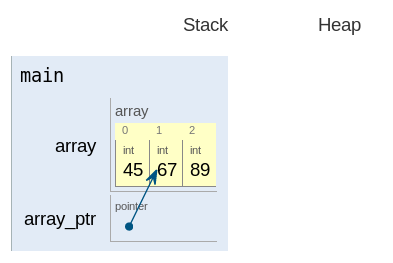

# Everything you need to know  about pointers in C


## Definition of a pointer

A pointer is a primitive C type that stores a memory address.

## Starting off

Say you declare a variable named foo.

```
int foo;
```

This variable occupies some memory. On current mainstream Intel processors, it occupies four bytes of memory 
(because an int is four bytes wide).

Now let's declare another variable.

```
int *foo_ptr = &foo;
```

foo_ptr is declared as a pointer to int. We have initialized it to point to foo.

As I said, foo occupies some memory. Its location in memory is called its address. &foo is the address of foo (which 
is why & is called the “address-of operator”).

Think of every variable as a box. foo is a box that is sizeof(int) bytes in size. The location of this box is its 
address. When you access the address, you actually access the contents of the box it points to.

This is true of all variables, regardless of type. In fact, grammatically speaking, there is no such thing as a
“pointer variable”: all variables are the same. There are, however, variables with different types. foo's type is int.
foo_ptr's type is int *. (Thus, “pointer variable” really means “variable of a pointer type”).

The point of that is that the pointer is not the variable! The pointer to foo is the contents of foo_ptr. You could 
put a different pointer in the foo_ptr box, and the box would still be foo_ptr. But it would no longer point to foo.


The pointer has a type, too, by the way. Its type is int. Thus it is an “int pointer” (a pointer to int). 
An int **'s type is int * (it points to a pointer to int). The use of pointers to pointers is called multiple 
indirection. More on that in a bit.

To excite your appetite:

```
int main()
{
  int a = 10;
  int *ptr_to_a = &a;
  return 0;
}
```


## Interlude: Declaration syntax

The obvious way to declare two pointer variables in a single declaration is:

```
int* ptr_a, ptr_b;
```

- If the type of a variable containing a pointer to int is int *,
- and a single declaration can declare multiple variables of the same type by simply providing a comma-separated list
 (ptr_a, ptr_b),
- then you can declare multiple int-pointer variables by simply giving the int-pointer type (int *) followed by a
 comma-separated list of names to use for the variables (ptr_a, ptr_b).

Given this, what is the type of ptr_b? int *, right?

*bzzt* Wrong!

The type of ptr_b is int. It is not a pointer.

C's declaration syntax ignores the pointer asterisks when carrying a type over to multiple declarations. If you split 
the declaration of ptr_a and ptr_b into multiple declarations, you get this:

```
int *ptr_a;
int  ptr_b;
```

Think of it as assigning each variable a base type (int), plus a level of indirection, indicated by the number of 
asterisks (ptr_b's is zero; ptr_a's is one).

It's possible to do the single-line declaration in a clear way. This is the immediate improvement:

```
int *ptr_a, ptr_b;
```

Notice that the asterisk has moved. It is now right next to the word ptr_a. A subtle implication of association.

It's even clearer to put the non-pointer variables first:

```
int ptr_b, *ptr_a;
```

The absolute clearest is to keep every declaration on its own line, but that can take up a lot of vertical space. 
Just use your own judgment.

Finally, I should point out that you can do this just fine:

```
int *ptr_a, *ptr_b;
```

There's nothing wrong with it.

Incidentally, C allows zero or more levels of parentheses around the variable name and asterisk:

```
int ((not_a_pointer)), (*ptr_a), (((*ptr_b)));
```

This is not useful for anything, except to declare function pointers (described later).

## Assignment and pointers

Now, how do you assign an int to this pointer? This solution might be obvious:

```
foo_ptr = 42;
```

*bzzt* wrong again!

Any direct assignment to a pointer variable will change the address in the variable, not the value at that address. 
In this example, the new value of foo_ptr (that is, the new “pointer” in that variable) is 42. But we don't know that 
this points to anything, so it probably doesn't. Trying to access this address will probably result in a segmentation
 violation (read: crash).

(Incidentally, compilers usually warn when you try to assign an int to a pointer variable. gcc will say
“warning: initialization makes pointer from integer without a cast”.).

So how do you access the value at a pointer?
You must dereference it.

## Dereferencing

```
int bar = *foo_ptr;
```

In this declaration, the dereference operator (prefix *, not to be confused with the multiplication operator) looks up
the value that exists at an address.

(This is called a “load” operation.).

It's also possible to write to a dereference expression (the C way of saying this: a dereference expression is an
lvalue, meaning that it can appear on the left side of an assignment):

```
*foo_ptr = 42; Sets foo to 42;
```

(This is called a “store” operation.).

## Interlude: Arrays

Here's a declaration of a three-int array:

```
int array[] = { 45, 67, 89 };
```

Note that we use the [] notation because we are declaring an array. `int *array` would be illegal here; the compiler 
would not accept us assigning the { 45, 67, 89 } initializer to it.

This variable, array, is an extra-big box: three ints' worth of storage.

One neat feature of C is that, in most places, when you use the name array again, you will actually be using a pointer
to its first element (in C terms, `&array[0]`). This is called “decaying”: the array “decays” to a pointer. Most usages 
of array are equivalent to if array had been declared as a pointer.

There are, of course, cases that aren't equivalent. One is assigning to the name array by itself (array = …)
—that's illegal.

Another is passing it to the sizeof operator. The result will be the total size of the array, not the size of a 
pointer (for example, sizeof(array) using the array above would evaluate to (sizeof(int) = 4) × 3 = 12 on a current Mac OS X system). This illustrates that you are really handling an array and not merely a pointer.

In most uses, however, array expressions work just the same as pointer expressions.

So, for example, let's say you want to pass an array to printf. You can't: When you pass an array as an argument
to a function, you really pass a pointer to the array's first element, because the array decays to a pointer. 
You can only give printf the pointer, not the whole array. (This is why printf has no way to print an array: It would
need you to tell it the type of what's in the array and how many elements there are, and both the format string and
the list of arguments would quickly get confusing.)

Decaying is an implicit &; `array == &array == &array[0]`. In English, these expressions read “array”,
“pointer to array”, and “pointer to the first element of array” (the subscript operator, [], has higher precedence 
than the address-of operator). But in C, all three expressions mean the same thing.

(They would not all mean the same thing if “array” were actually a pointer variable, since the address of a pointer
variable is different from the address inside it—thus, the middle expression, `&array`, would not be equal to the other
two expressions. The three expressions are all equal only when array really is an array.)

## Pointer arithmetic (or: why 1 == 4)

Say we want to print out all three elements of array.

```
int *array_ptr = array;
printf(" first element: %i\n", *(array_ptr++));
printf("second element: %i\n", *(array_ptr++));
printf(" third element: %i\n", *array_ptr);
```
```
first element: 45
second element: 67
third element: 89
```

In case you're not familiar with the ++ operator: it adds 1 to a variable, the same as variable += 1 (remember that
because we used the postfix expression array_ptr++, rather than the prefix expression ++array_ptr, the expression 
evaluated to the value of array_ptr from before it was incremented rather than after).

But what did we do with it here?

Well, the type of a pointer matters. The type of the pointer here is int. When you add to or subtract from a pointer,
the amount by which you do that is multiplied by the size of the type of the pointer. In the case of our three 
increments, each 1 that you added was multiplied by sizeof(int).

By the way, though sizeof(void) is illegal, void pointers are incremented or decremented by 1 byte.

In case you're wondering about 1 == 4: Remember that earlier, I mentioned that ints are four bytes on current
Intel processors. So, on a machine with such a processor, adding 1 to or subtracting 1 from an int pointer changes
it by four bytes. Hence, 1 == 4. (Programmer humor.).

## Indexing

```
int array[] = { 45, 67, 89 };
printf("%i\n", array[0]);
```

OK… what just happened?

This happened:

```
45
```

Well, you probably figured that. But what does this have to do with pointers?

This is another one of those secrets of C. The subscript operator (the [] in array[0]) has nothing to do with arrays.

Oh, sure, that's its most common usage. But remember that, in most contexts, arrays decay to pointers. This is one of them: That's a pointer you passed to that operator, not an array.

As evidence, I submit:

```
int array[] = { 45, 67, 89 };
int *array_ptr = &array[1];
printf("%i\n", array_ptr[1]);
```

```
89
```

That one might bend the brain a little. Here's a diagram:





array points to the first element of the array; array_ptr is set to &array[1], so it points to the second element of
the array. So array_ptr[1] is equivalent to array[2] (array_ptr starts at the second element of the array, so the 
second element of array_ptr is the third element of the array).

Also, you might notice that because the first element is sizeof(int) bytes wide (being an int), the second element 
is sizeof(int) bytes forward of the start of the array. You are correct: array[1] is equivalent to *(array + 1). 
(Remember that the number added to or subtracted from a pointer is multiplied by the size of the pointer's type, so 
that “1” adds sizeof(int) bytes to the pointer value.)

## Interlude: Structures and unions

Two of the more interesting kinds of types in C are structures and unions. You create a structure type with the 
struct keyword, and a union type with the union keyword.

The exact definitions of these types are beyond the scope of this article. Suffice to say that a declaration of a 
struct or union looks like this:

```
struct foo {
  size_t size;
  char name[64];
  int answer_to_ultimate_question;
  unsigned shoe_size;
};
```

Each of those declarations inside the block is called a member. Unions have members too, but they're used differently. 

Accessing a member looks like this:

```
struct foo my_foo;
my_foo.size = sizeof(struct foo);
```

The expression my_foo.size accesses the member size of my_foo.

So what do you do if you have a pointer to a structure?

One way to do it

```
(*foo_ptr).size = new_size;
```

But there is a better way, specifically for this purpose: the pointer-to-member operator.

Yummy:

```
foo_ptr->size = new_size;
```

Unfortunately, it doesn't look as good with multiple indirection.

Icky:

```
(*foo_ptr_ptr)->size = new_size; One way
(**foo_ptr_ptr).size = new_size; or another
```

Rant: Pascal does this much better. Its dereference operator is a postfix ^:

```
foo_ptr_ptr^^.size := new_size;
```

(But putting aside this complaint, C is a much better language.)

## Multiple indirection

I want to explain multiple indirection a bit further.

Consider the following code:

```
int    a =  3;
int   *b = &a;
int  **c = &b;
int ***d = &c;
```

Here are how the values of these pointers equate to each other:

```
  *d ==   c; // Dereferencing an (int ***) once gets you an (int **) (3 - 1 = 2)
 **d ==  *c ==  b; // Dereferencing an (int ***) twice, or an (int **) once, gets you an (int *) (3 - 2 = 1; 2 - 1 = 1)
***d == **c == *b == a == 3; // Dereferencing an (int ***) thrice, or an (int **) twice, or an (int *) once, gets you an int (3 - 3 = 0; 2 - 2 = 0; 1 - 1 = 0)
```

Thus, the & operator can be thought of as adding asterisks (increasing pointer level, as I call it), and the *, ->, 
and [] operators as removing asterisks (decreasing pointer level).

## Pointers and const
## Function pointers
## Strings (and why there is no such thing)
