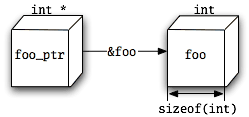
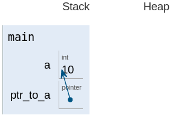

# Everything you need to know  about pointers in C


## Definition of a pointer

A pointer is a primitive C type that stores a memory address.

## Starting off

Say you declare a variable named foo.

```
int foo;
```

This variable occupies some memory. On current mainstream Intel processors, it occupies four bytes of memory 
(because an int is four bytes wide).

Now let's declare another variable.

```
int *foo_ptr = &foo;
```

foo_ptr is declared as a pointer to int. We have initialized it to point to foo.

As I said, foo occupies some memory. Its location in memory is called its address. &foo is the address of foo (which 
is why & is called the “address-of operator”).

Think of every variable as a box. foo is a box that is sizeof(int) bytes in size. The location of this box is its 
address. When you access the address, you actually access the contents of the box it points to.

This is true of all variables, regardless of type. In fact, grammatically speaking, there is no such thing as a
“pointer variable”: all variables are the same. There are, however, variables with different types. foo's type is int.
foo_ptr's type is int *. (Thus, “pointer variable” really means “variable of a pointer type”).

The point of that is that the pointer is not the variable! The pointer to foo is the contents of foo_ptr. You could 
put a different pointer in the foo_ptr box, and the box would still be foo_ptr. But it would no longer point to foo.



The pointer has a type, too, by the way. Its type is int. Thus it is an “int pointer” (a pointer to int). 
An int **'s type is int * (it points to a pointer to int). The use of pointers to pointers is called multiple 
indirection. More on that in a bit.

To excite your appetite:

```
int main()
{
  int a = 10;
  int *ptr_to_a = &a;
  return 0;
}
```



## Interlude: Declaration syntax

The obvious way to declare two pointer variables in a single declaration is:

```
int* ptr_a, ptr_b;
```

- If the type of a variable containing a pointer to int is int *,
- and a single declaration can declare multiple variables of the same type by simply providing a comma-separated list
 (ptr_a, ptr_b),
- then you can declare multiple int-pointer variables by simply giving the int-pointer type (int *) followed by a
 comma-separated list of names to use for the variables (ptr_a, ptr_b).

Given this, what is the type of ptr_b? int *, right?

*bzzt* Wrong!

The type of ptr_b is int. It is not a pointer.

C's declaration syntax ignores the pointer asterisks when carrying a type over to multiple declarations. If you split 
the declaration of ptr_a and ptr_b into multiple declarations, you get this:

```
int *ptr_a;
int  ptr_b;
```

Think of it as assigning each variable a base type (int), plus a level of indirection, indicated by the number of 
asterisks (ptr_b's is zero; ptr_a's is one).

It's possible to do the single-line declaration in a clear way. This is the immediate improvement:

```
int *ptr_a, ptr_b;
```

Notice that the asterisk has moved. It is now right next to the word ptr_a. A subtle implication of association.

It's even clearer to put the non-pointer variables first:

```
int ptr_b, *ptr_a;
```

The absolute clearest is to keep every declaration on its own line, but that can take up a lot of vertical space. 
Just use your own judgment.

Finally, I should point out that you can do this just fine:

```
int *ptr_a, *ptr_b;
```

There's nothing wrong with it.

Incidentally, C allows zero or more levels of parentheses around the variable name and asterisk:

```
int ((not_a_pointer)), (*ptr_a), (((*ptr_b)));
```

This is not useful for anything, except to declare function pointers (described later).

## Assignment and pointers

Now, how do you assign an int to this pointer? This solution might be obvious:

```
foo_ptr = 42;
```

*bzzt* wrong again!

Any direct assignment to a pointer variable will change the address in the variable, not the value at that address. 
In this example, the new value of foo_ptr (that is, the new “pointer” in that variable) is 42. But we don't know that 
this points to anything, so it probably doesn't. Trying to access this address will probably result in a segmentation
 violation (read: crash).

(Incidentally, compilers usually warn when you try to assign an int to a pointer variable. gcc will say
“warning: initialization makes pointer from integer without a cast”.).

So how do you access the value at a pointer?
You must dereference it.

## Dereferencing

```
int bar = *foo_ptr;
```

In this declaration, the dereference operator (prefix *, not to be confused with the multiplication operator) looks up
the value that exists at an address.

(This is called a “load” operation.).

It's also possible to write to a dereference expression (the C way of saying this: a dereference expression is an
lvalue, meaning that it can appear on the left side of an assignment):

```
*foo_ptr = 42; Sets foo to 42;
```

(This is called a “store” operation.).

## Interlude: Arrays
## Pointer arithmetic (or: why 1 == 4)
## Indexing
## Interlude: Structures and unions
## Multiple indirection
## Pointers and const
## Function pointers
## Strings (and why there is no such thing)
