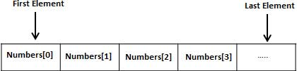

# Arrays

Arrays a kind of data structure that can store a fixed-size sequential collection of elements of the same type. An array 
is used to store a collection of data, but it is often more useful to think of an array as a collection of variables of 
the same type.

Instead of declaring individual variables, such as number0, number1, ..., and number99, you declare one array variable 
such as numbers and use numbers[0], numbers[1], and ..., numbers[99] to represent individual variables. A specific 
element in an array is accessed by an index.

All arrays consist of contiguous memory locations. 
The lowest address corresponds to the first element and the highest address to the last element.



## Declaring Arrays

To declare an array in C, a programmer specifies the type of the elements and the number of elements required by an 
array as follows:

    type arrayName [ arraySize ];

This is called a single-dimensional array. The arraySize must be an integer constant greater than zero and type can be 
any valid C data type. For example, to declare a 10-element array called balance of type double, use this statement:

    double balance[10];

Here balance is a variable array which is sufficient to hold up to 10 double numbers.

## Initializing Arrays

You can initialize an array in C either one by one or using a single statement as follows:

    double balance[5] = {1000.0, 2.0, 3.4, 7.0, 50.0};

The number of values between braces { } cannot be larger than the number of elements that we declare for the array 
between square brackets [ ].

If you omit the size of the array, an array just big enough to hold the initialization is created. Therefore, if you 
write:

    double balance[] = {1000.0, 2.0, 3.4, 7.0, 50.0};

You will create exactly the same array as you did in the previous example. 

Following is an example to assign a single element of the array:

    balance[4] = 50.0;

The above statement assigns the 5th element in the array with a value of 50.0. All arrays have 0 as the index of their 
first element which is also called the base index and the last index of an array will be total size of the array 
minus 1. 

Shown below is the pictorial representation of the array we discussed above.


##Accessing Array Elements

An element is accessed by indexing the array name. This is done by placing the index of the element within square 
brackets after the name of the array. For example:

    double salary = balance[9];

The above statement will take the 10th element from the array and assign the value to salary variable. 

The following example shows how to use all the three above mentioned concepts viz. declaration, assignment, and 
accessing arrays:

```
#include <stdio.h>

int main ()
{

        int n[10]; /* n is an array of 10 integers */
        int i, j;

        /* initialize elements of array n to 0 */
        for (i = 0; i < 10; i++) {
                n[i] = i + 100; /* set element at location i to i + 100 */
        }

        /* output each array element's value */
        for (j = 0; j < 10; j++) {
                printf ("Element[%d] = %d\n", j, n[j]);
        }

        return 0;
}
```

When the above code is compiled and executed, it produces the following result −

```
Element[0] = 100
Element[1] = 101
Element[2] = 102
Element[3] = 103
Element[4] = 104
Element[5] = 105
Element[6] = 106
Element[7] = 107
Element[8] = 108
Element[9] = 109
```

## Arrays in detail

C programming language allows multidimensional arrays. Here is the general form of a multidimensional array 
declaration:

    type name[size1][size2]...[sizeN];

For example, the following declaration creates a three dimensional integer array:

    int threedim[5][10][4];

### Multi-dimensional arrays

#### Two-dimensional Arrays

The simplest form of multidimensional array is the two-dimensional array. A two-dimensional array is, in essence, a 
list of one-dimensional arrays. To declare a two-dimensional integer array of size [x][y], you would write something as 
follows:

    type arrayName [ x ][ y ];

Where type can be any valid C data type and arrayName will be a valid C identifier. A two-dimensional array can be 
considered as a table which will have x number of rows and y number of columns. A two-dimensional array a, which 
contains three rows and four columns can be shown as follows:


Thus, every element in the array a is identified by an element name of the form a[ i ][ j ], where 'a' is the name of 
the array, and 'i' and 'j' are the subscripts that uniquely identify each element in 'a'.

#### Initializing Two-Dimensional Arrays

Multidimensional arrays may be initialized by specifying bracketed values for each row. Following is an array with 3 
rows and each row has 4 columns.

```
int a[3][4] = {
        {0, 1, 2,  3},   /*  initializers for row indexed by 0 */
        {4, 5, 6,  7},   /*  initializers for row indexed by 1 */
        {8, 9, 10, 11}   /*  initializers for row indexed by 2 */
};
```

The nested braces, which indicate the intended row, are optional. The following initialization is equivalent to the 
previous example:

    int a[3][4] = {0,1,2,3,4,5,6,7,8,9,10,11};

#### Accessing Two-Dimensional Array Elements
     
An element in a two-dimensional array is accessed by using the subscripts, i.e., row index and column index of the 
array. For example:

    int val = a[2][3];
     
The above statement will take the 4th element from the 3rd row of the array. You can verify it in the above figure. 
Let us check the following program where we have used a nested loop to handle a two-dimensional array:

```
#include <stdio.h>

int main ()
{

        /* an array with 5 rows and 2 columns*/
        int a[5][2] = {{0, 0},
                       {1, 2},
                       {2, 4},
                       {3, 6},
                       {4, 8}};
        int i, j;

        /* output each array element's value */
        for (i = 0; i < 5; i++) {

                for (j = 0; j < 2; j++) {
                        printf ("a[%d][%d] = %d\n", i, j, a[i][j]);
                }
        }

        return 0;
}
```

When the above code is compiled and executed, it produces the following result −

```
a[0][0]: 0
a[0][1]: 0
a[1][0]: 1
a[1][1]: 2
a[2][0]: 2
a[2][1]: 4
a[3][0]: 3
a[3][1]: 6
a[4][0]: 4
a[4][1]: 8
```

As explained above, you can have arrays with any number of dimensions, although it is likely that most of the arrays 
you create will be of one or two dimensions.

### Passing arrays to functions

If you want to pass a single-dimension array as an argument in a function, you would have to declare a formal parameter 
in one of following three ways and all three declaration methods produce similar results because each tells the compiler 
that an integer pointer is going to be received. Similarly, you can pass multi-dimensional arrays as formal parameters.

#### Way-1

Formal parameters as a pointer:

    void myFunction(int *param) {
        .
        .
        .
    }

#### Way-2

Formal parameters as a sized array:

    void myFunction(int param[10]) {
        .
        .
        .
    }

#### Way-3

Formal parameters as an unsized array:

    void myFunction(int param[]) {
        .
        .
        .
    }

#### Example

Now, consider the following function, which takes an array as an argument along with another argument and based on the 
passed arguments, it returns the average of the numbers passed through the array as follows:

```
double getAverage (int arr[], int size)
{

        int i;
        double avg;
        double sum = 0;

        for (i = 0; i < size; ++i) {
                sum += arr[i];
        }

        avg = sum / size;

        return avg;
}
```

Now, let us call the above function as follows:

```
#include <stdio.h>

/* function declaration */
double getAverage (int arr[], int size);

int main ()
{

        /* an int array with 5 elements */
        int balance[5] = {1000, 2, 3, 17, 50};
        double avg;

        /* pass pointer to the array as an argument */
        avg = getAverage (balance, 5);

        /* output the returned value */
        printf ("Average value is: %f ", avg);

        return 0;
}
```

When the above code is compiled together and executed, it produces the following result:

    Average value is: 214.400000

As you can see, the length of the array doesn't matter as far as the function is concerned because C performs no bounds 
checking for formal parameters.

### Return array from a function

C programming does not allow to return an entire array as an argument to a function. However, you can return a pointer 
to an array by specifying the array's name without an index.

If you want to return a single-dimension array from a function, you would have to declare a function returning a pointer 
as in the following example:

    int * myFunction() {
        .
        .
        .
    }

Second point to remember is that C does not advocate to return the address of a local variable to outside of the 
function, so you would have to define the local variable as **_static_** variable.

Now, consider the following function which will generate 10 random numbers and return them using an array and call this 
function as follows:

```
#include <stdio.h>

/* function to generate and return random numbers */
int *getRandom ()
{

        static int r[10];
        int i;

        /* set the seed */
        srand ((unsigned) time (NULL));

        for (i = 0; i < 10; ++i) {
                r[i] = rand ();
                printf ("r[%d] = %d\n", i, r[i]);
        }

        return r;
}

/* main function to call above defined function */
int main ()
{

        /* a pointer to an int */
        int *p;
        int i;

        p = getRandom ();

        for (i = 0; i < 10; i++) {
                printf ("*(p + %d) : %d\n", i, *(p + i));
        }

        return 0;
}
```

When the above code is compiled together and executed, it produces the following result:

```
r[0] = 313959809
r[1] = 1759055877
r[2] = 1113101911
r[3] = 2133832223
r[4] = 2073354073
r[5] = 167288147
r[6] = 1827471542
r[7] = 834791014
r[8] = 1901409888
r[9] = 1990469526
*(p + 0) : 313959809
*(p + 1) : 1759055877
*(p + 2) : 1113101911
*(p + 3) : 2133832223
*(p + 4) : 2073354073
*(p + 5) : 167288147
*(p + 6) : 1827471542
*(p + 7) : 834791014
*(p + 8) : 1901409888
*(p + 9) : 1990469526
```

### Pointer to an array

**_It is most likely that you would not understand this section until you are through with the chapter 'Pointers'._**

Assuming you have some understanding of pointers in C, let us start: An array name is a constant pointer to the first 
element of the array. Therefore, in the declaration:

    double balance[50];

balance is a pointer to &balance[0], which is the address of the first element of the array balance. Thus, the following 
program fragment assigns p as the address of the first element of balance:

    double *p;
    double balance[10];

    p = balance;

It is legal to use array names as constant pointers, and vice versa. Therefore, *(balance + 4) is a legitimate way of 
accessing the data at balance[4].

Once you store the address of the first element in 'p', you can access the array elements using *p, *(p+1), *(p+2) and 
so on. 
Given below is the example to show all the concepts discussed above:

```
#include <stdio.h>

int main ()
{

        /* an array with 5 elements */
        double balance[5] = {1000.0, 2.0, 3.4, 17.0, 50.0};
        double *p;
        int i;

        p = balance;

        /* output each array element's value */
        printf ("Array values using pointer\n");

        for (i = 0; i < 5; i++) {
                printf ("*(p + %d) : %f\n", i, *(p + i));
        }

        printf ("Array values using balance as address\n");

        for (i = 0; i < 5; i++) {
                printf ("*(balance + %d) : %f\n", i, *(balance + i));
        }

        return 0;
}
```

When the above code is compiled and executed, it produces the following result −

```
Array values using pointer
*(p + 0) : 1000.000000
*(p + 1) : 2.000000
*(p + 2) : 3.400000
*(p + 3) : 17.000000
*(p + 4) : 50.000000
Array values using balance as address
*(balance + 0) : 1000.000000
*(balance + 1) : 2.000000
*(balance + 2) : 3.400000
*(balance + 3) : 17.000000
*(balance + 4) : 50.000000
```

In the above example, p is a pointer to double, which means it can store the address of a variable of double type. 
Once we have the address in p, *p will give us the value available at the address stored in p, as we have shown in the 
above example.