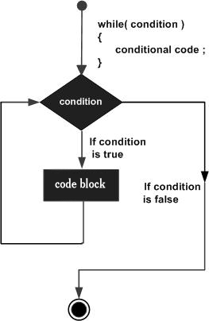
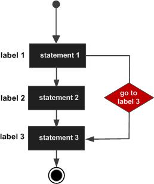

# Loops

You may encounter situations, when a block of code needs to be executed several number of times. In general, statements 
are executed sequentially: The first statement in a function is executed first, followed by the second, and so on.

Programming languages provide various control structures that allow for more complicated execution paths.

A loop statement allows us to execute a statement or group of statements multiple times. Given below is the general 
form of a loop statement in most of the programming languages.


## while loop

A while loop in C programming repeatedly executes a target statement as long as a given condition is true.

### Syntax

The syntax of a while loop in C programming language is:

    while(condition) {
       statement(s);
    }

Here, statement(s) may be a single statement or a block of statements. The condition may be any expression, and true 
is any nonzero value. The loop iterates while the condition is true.

When the condition becomes false, the program control passes to the line immediately following the loop.

### Flow diagram



### Example

```
#include <stdio.h>

int main ()
{

        /* local variable definition */
        int a = 10;

        /* while loop execution */
        while (a < 20) {
                printf ("value of a: %d\n", a);
                a++;
        }

        return 0;
}
```

When the above code is compiled and executed, it produces the following result:

```
value of a: 10
value of a: 11
value of a: 12
value of a: 13
value of a: 14
value of a: 15
value of a: 16
value of a: 17
value of a: 18
value of a: 19
```

## for loop

A for loop is a repetition control structure that allows you to efficiently write a loop that needs to execute a 
specific number of times.

### Syntax

The syntax of a for loop in C programming language is −

    for ( init; condition; increment ) {
        statement(s);
    }

Here is the flow of control in a 'for' loop:

- The init step is executed first, and only once. This step allows you to declare and initialize any loop control 
variables. You are not required to put a statement here, as long as a semicolon appears.

- Next, the condition is evaluated. If it is true, the body of the loop is executed. If it is false, the body of the 
loop does not execute and the flow of control jumps to the next statement just after the 'for' loop.

- After the body of the 'for' loop executes, the flow of control jumps back up to the increment statement. This 
statement allows you to update any loop control variables. This statement can be left blank, as long as a semicolon 
appears after the condition.

- The condition is now evaluated again. If it is true, the loop executes and the process repeats itself (body of loop, 
then increment step, and then again condition). After the condition becomes false, the 'for' loop terminates.

### Flow Diagram


### Example

```
#include <stdio.h>

int main () {

        int a;

        /* for loop execution */
        for( a = 10; a < 20; a = a + 1 ){
                printf("value of a: %d\n", a);
        }

        return 0;
}
```

When the above code is compiled and executed, it produces the following result −

```
value of a: 10
value of a: 11
value of a: 12
value of a: 13
value of a: 14
value of a: 15
value of a: 16
value of a: 17
value of a: 18
value of a: 19
```

## do ... while loop

Unlike for and while loops, which test the loop condition at the top of the loop, the do...while loop in C programming 
checks its condition at the bottom of the loop.

A do...while loop is similar to a while loop, except the fact that it is guaranteed to execute at least one time.

### Syntax

The syntax of a do...while loop in C programming language is −

    do {
        statement(s);
    } while( condition );

Notice that the conditional expression appears at the end of the loop, so the statement(s) in the loop executes once 
before the condition is tested.

If the condition is true, the flow of control jumps back up to do, and the statement(s) in the loop executes again. 
This process repeats until the given condition becomes false.

### Flow Diagram


### Example

```
#include <stdio.h>

int main ()
{

        /* local variable definition */
        int a = 10;

        /* do loop execution */
        do {
                printf ("value of a: %d\n", a);
                a = a + 1;
        } while (a < 20);

        return 0;
}
```

When the above code is compiled and executed, it produces the following result:

```
value of a: 10
value of a: 11
value of a: 12
value of a: 13
value of a: 14
value of a: 15
value of a: 16
value of a: 17
value of a: 18
value of a: 19
```

## Nested loop

C programming allows to use one loop inside another loop. The following section shows a few examples to illustrate the 
concept.

### Syntax

The syntax for a nested for loop statement in C is as follows:

    for ( init; condition; increment ) {

        for ( init; condition; increment ) {
            statement(s);
    }
    statement(s);
    }

The syntax for a nested while loop statement in C programming language is as follows:

    while(condition) {

        while(condition) {
            statement(s);
        }
        statement(s);
    }

The syntax for a nested do...while loop statement in C programming language is as follows −

    do {
    
        statement(s);

        do {
            statement(s);
        }while( condition );
        
    }while( condition );

A final note on loop nesting is that you can put any type of loop inside any other type of loop. For example, a 'for' 
loop can be inside a 'while' loop or vice versa.
Example

The following program uses a nested for loop to find the prime numbers from 2 to 100:

```
#include <stdio.h>

int main ()
{

        /* local variable definition */
        int i, j;

        for (i = 2; i < 100; i++) {

                for (j = 2; j <= (i / j); j++)
                        if (!(i % j)) break; // if factor found, not prime
                if (j > (i / j)) printf ("%d is prime\n", i);
        }

        return 0;
}
```

When the above code is compiled and executed, it produces the following result:

```
2 is prime
3 is prime
5 is prime
7 is prime
11 is prime
13 is prime
17 is prime
19 is prime
23 is prime
29 is prime
31 is prime
37 is prime
41 is prime
43 is prime
47 is prime
53 is prime
59 is prime
61 is prime
67 is prime
71 is prime
73 is prime
79 is prime
83 is prime
89 is prime
97 is prime
```

## Loop control statements

Loop control statements change execution from its normal sequence. When execution leaves a scope, all automatic 
objects that were created in that scope are destroyed.

### break statement

The break statement in C programming has the following two usages:

- When a break statement is encountered inside a loop, the loop is immediately terminated and the program control 
resumes at the next statement following the loop.

- It can be used to terminate a case in the switch statement (covered in the next chapter).

If you are using nested loops, the break statement will stop the execution of the innermost loop and start executing 
the next line of code after the block.

#### Syntax

The syntax for a break statement in C is as follows:

    break;

#### Flow diagram


#### Example

```
#include <stdio.h>

int main ()
{

        /* local variable definition */
        int a = 10;

        /* while loop execution */
        while (a < 20) {

                printf ("value of a: %d\n", a);
                a++;

                if (a > 15) {
                        /* terminate the loop using break statement */
                        break;
                }
        }

        return 0;
}
```

When the above code is compiled and executed, it produces the following result:

```
value of a: 10
value of a: 11
value of a: 12
value of a: 13
value of a: 14
value of a: 15
```

### continue statement

The continue statement in C programming works somewhat like the break statement. Instead of forcing termination, 
it forces the next iteration of the loop to take place, skipping any code in between.

- For the for loop, continue statement causes the conditional test and increment portions of the loop to execute. 

- For the while and do...while loops, continue statement causes the program control to pass to the conditional tests.

#### Syntax

The syntax for a continue statement in C is as follows:

    continue;

#### Flow diagram


#### Example

```
#include <stdio.h>

int main ()
{

        /* local variable definition */
        int a = 10;

        /* do loop execution */
        do {

                if (a == 15) {
                        /* skip the iteration */
                        a = a + 1;
                        continue;
                }

                printf ("value of a: %d\n", a);
                a++;

        } while (a < 20);

        return 0;
}
```

When the above code is compiled and executed, it produces the following result:

```
value of a: 10
value of a: 11
value of a: 12
value of a: 13
value of a: 14
value of a: 16
value of a: 17
value of a: 18
value of a: 19
```

### goto statement

A goto statement in C programming provides an unconditional jump from the 'goto' to a labeled statement in the same 
function.

NOTE: Use of goto statement is highly discouraged in any programming language because it makes difficult to trace the 
control flow of a program, making the program hard to understand and hard to modify. 

**_Any program that uses a goto can be rewritten to avoid them!_**

#### Syntax

The syntax for a goto statement in C is as follows −

    goto label;
    ..
    .
    label: statement;

Here label can be any plain text except C keyword and it can be set anywhere in the C program above or below to goto 
statement.

#### Flow Diagram



#### Example

```
#include <stdio.h>

int main ()
{

        /* local variable definition */
        int a = 10;

        /* do loop execution */
        LOOP:
        do {

                if (a == 15) {
                        /* skip the iteration */
                        a = a + 1;
                        goto LOOP;
                }

                printf ("value of a: %d\n", a);
                a++;

        } while (a < 20);

        return 0;
}
```

When the above code is compiled and executed, it produces the following result:

```
value of a: 10
value of a: 11
value of a: 12
value of a: 13
value of a: 14
value of a: 16
value of a: 17
value of a: 18
value of a: 19
```

## The infinite loop

A loop becomes an infinite loop if a condition never becomes false. The for loop is traditionally used for this purpose. 
Since none of the three expressions that form the 'for' loop are required, you can make an endless loop by leaving the 
conditional expression empty.

```
#include <stdio.h>

int main ()
{

        for (;;) {
                printf ("This loop will run forever.\n");
        }

        return 0;
}
```

When the conditional expression is absent, it is assumed to be true. You may have an initialization and increment 
expression, but C programmers more commonly use the for(;;) construct to signify an infinite loop.

Note: You can terminate an infinite loop by pressing Ctrl + C keys.
