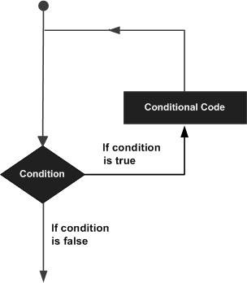

# Loops

You may encounter situations, when a block of code needs to be executed several number of times. In general, statements 
are executed sequentially: The first statement in a function is executed first, followed by the second, and so on.

Programming languages provide various control structures that allow for more complicated execution paths.

A loop statement allows us to execute a statement or group of statements multiple times. Given below is the general 
form of a loop statement in most of the programming languages.



## while loop

A while loop in C programming repeatedly executes a target statement as long as a given condition is true.

### Syntax

The syntax of a while loop in C programming language is:

    while(condition) {
       statement(s);
    }

Here, statement(s) may be a single statement or a block of statements. The condition may be any expression, and true 
is any nonzero value. The loop iterates while the condition is true.

When the condition becomes false, the program control passes to the line immediately following the loop.

### Flow diagram


### Example

```
#include <stdio.h>

int main ()
{

        /* local variable definition */
        int a = 10;

        /* while loop execution */
        while (a < 20) {
                printf ("value of a: %d\n", a);
                a++;
        }

        return 0;
}
```

When the above code is compiled and executed, it produces the following result −

```
value of a: 10
value of a: 11
value of a: 12
value of a: 13
value of a: 14
value of a: 15
value of a: 16
value of a: 17
value of a: 18
value of a: 19
```

## for loop

## do ... while loop

## Nested loop

## Loop control statements

### break statement

### continue statement

### goto statement

## The infinite loop

