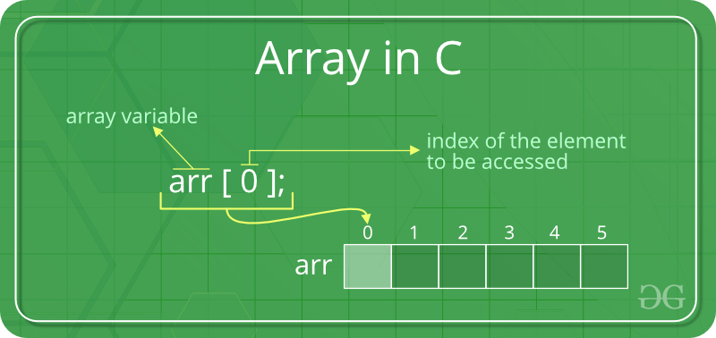
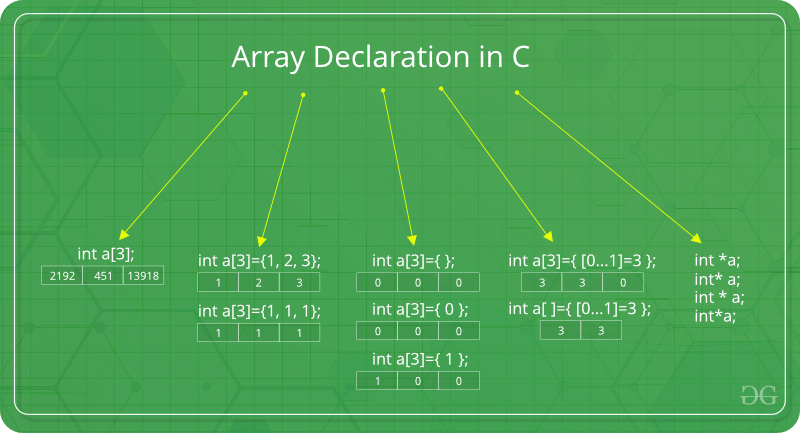

# Introduction to Arrays

An array is collection of items stored at contiguous memory locations.
The idea is to store multiple items of same type together.
This makes it easier to calculate the position of each element by simply adding an offset to a base value, i.e.,
the memory location of the first element of the array (generally denoted by the name of the array).

For simplicity, we can think of an array a fleet of stairs where on each step is placed a value
(let’s say one of your friends).
Here, you can identify the location of any of your friends by simply knowing the count of the step they are on.

> **Remember:** “Location of next index depends on the data type we use”.


The above image can be looked as a top-level view of a staircase where you are at the base of staircase.
Each element can be uniquely identified by their index in the array (in a similar way as you could identify your 
friends by the step on which they were on in the above example).

## Types of indexing in array:

- ### 0 (zero-based indexing):

    The first element of the array is indexed by subscript of 0

- ### 1 (one-based indexing):

    The first element of the array is indexed by subscript of 1

- ### n (n-based indexing):

    The base index of an array can be freely chosen. Usually programming languages allowing n-based indexing also 
    allow negative index values and other scalar data types like enumerations, or characters may be used as an 
    array index.



## Advantages of using arrays:

- Arrays allow random access of elements. This makes accessing elements by position faster.
- Arrays have better cache locality that can make a pretty big difference in performance.

## Examples:

### A character array in C

``` 
char arr1[] = {'g', 'e', 'e', 'k', 's'};
```

### An Integer array in C

```
int arr2[] = {10, 20, 30, 40, 50};
```

Item at i'th index in array is typically accessed as `arr[i]`.  For example `arr1[0]` gives us 'g'
and `arr2[3]` gives us 40.

Usually, an array of characters is called a ‘string’, whereas an array of ints or floats is called simply an 'array'.

# Arrays in C

An array is collection of items stored at **_continuous_** memory locations.


## Why do we need arrays?

We can use normal variables (v1, v2, v3, ..) when we have a small number of objects, but if we want to store a large
number of instances, it becomes difficult to manage them with normal variables. The idea of an array is to represent
many instances in one variable.

## Array declaration in C:



We can declare an array by specifying its type and size or by initializing it or by both.

### Array declaration by specifying size:

```
int arr1[10];
```

With recent C versions, we can also declare an array of user specified size:

```
int n = 10;
int arr2[n];
```

### Array declaration by initializing elements:

```
int arr[] = { 10, 20, 30, 40 }
```

Compiler creates an array of size 4.

above is same as:

```
int arr[4] = {10, 20, 30, 40}
``` 

### Array declaration by specifying size and initializing elements:

```
int arr[6] = { 10, 20, 30, 40 }
``` 

Compiler creates an array of size 6, initializes first 
4 elements as specified by user and rest two elements as 0.

above is same as: 

```
int arr[] = {10, 20, 30, 40, 0, 0};
``` 

### Facts about Array in C:

#### Accessing Array Elements:

Array elements are accessed by using an integer index. Array index starts with 0 and goes till size of array minus 1.


#### Following are a few examples:

```
#include <stdio.h>

int main ()
{
  int arr[5];
  arr[0] = 5;
  arr[2] = -10;
  arr[3 / 2] = 2;
  arr[3] = arr[0];
  printf ("%d %d %d %d", arr[0], arr[1], arr[2], arr[3]);
  return 0;
}
```

#### Output:

```
5 2 -10 5
```

#### No Index Out of bound Checking:

There is no index out of bounds checking in C.

For example, the following program compiles fine but may produce unexpected output when run.

```
#include <stdio.h> 

int main() 
{ 
    int arr[2]; 
    printf("%d ", arr[3]); 
    printf("%d ", arr[-2]); 
    return 0; 
} 
```
#### Output;

```
22069 -14954122
```

Also, In C, it is not compiler error to initialize an array with more
elements than the specified size. For example, the below program
compiles fine and shows just Warning.

```
#include <stdio.h> 
int main() 
{ 
    int arr[2] = { 10, 20, 30, 40, 50 }; 
    return 0; 
}
```

The program will compile with only warnings. These warning can be 
disabled.

```
Scanning dependencies of target arrays
[ 50%] Building C object CMakeFiles/arrays.dir/main.c.o
/home/tdecker/Documents/workspaces/c/arrays/main.c: In function ‘main’:
/home/tdecker/Documents/workspaces/c/arrays/main.c:4:25: warning: excess elements in array initializer
   int arr[2] = {10, 20, 30, 40, 50};
                         ^~
/home/tdecker/Documents/workspaces/c/arrays/main.c:4:25: note: (near initialization for ‘arr’)
/home/tdecker/Documents/workspaces/c/arrays/main.c:4:29: warning: excess elements in array initializer
   int arr[2] = {10, 20, 30, 40, 50};
                             ^~
/home/tdecker/Documents/workspaces/c/arrays/main.c:4:29: note: (near initialization for ‘arr’)
/home/tdecker/Documents/workspaces/c/arrays/main.c:4:33: warning: excess elements in array initializer
   int arr[2] = {10, 20, 30, 40, 50};
                                 ^~
/home/tdecker/Documents/workspaces/c/arrays/main.c:4:33: note: (near initialization for ‘arr’)
[100%] Linking C executable arrays
[100%] Built target arrays

Build finished
```

#### An Example to show that array elements are stored at contiguous locations

```
// C program to demonstrate that array elements are stored 
// contiguous locations 

#include <stdio.h>
int main ()
{
  // an array of 10 integers. If arr[0] is stored at 
  // address x, then arr[1] is stored at x + sizeof(int) 
  // arr[2] is stored at x + sizeof(int) + sizeof(int) 
  // and so on. 
  int arr[5], i;

  printf ("Size of integer in this compiler is %lu\n", sizeof (int));

  for (i = 0; i < 5; i++)
    // The use of '&' before a variable name, yields 
    // address of variable. 
    printf ("Address arr[%d] is %p\n", i, &arr[i]);

  return 0;
} 

```

#### Output:

```
Size of integer in this compiler is 4
Address arr[0] is 0x7ffdd0c28fd0
Address arr[1] is 0x7ffdd0c28fd4
Address arr[2] is 0x7ffdd0c28fd8
Address arr[3] is 0x7ffdd0c28fdc
Address arr[4] is 0x7ffdd0c28fe0
```

#### Array vs Pointers

Arrays and pointer are two different things (we can check by applying sizeof). The confusion happens because array name
indicates the address of first element and arrays are always passed as pointers (even if we use square bracket).

### Programs for array rotation

Write a function rotate(ar[], d, n) that rotates arr[] of size n by d elements.


Rotation of the above array by 2 will make array:


#### METHOD 1 (Using temp array):

```
Input arr[] = [1, 2, 3, 4, 5, 6, 7], d = 2, n =7
1) Store d elements in a temp array
   temp[] = [1, 2]
2) Shift rest of the arr[]
   arr[] = [3, 4, 5, 6, 7, 6, 7]
3) Store back the d elements
   arr[] = [3, 4, 5, 6, 7, 1, 2]
```
A solution:

```
/*
 * Rotation method 1 (Using temp array)
 * */
void array_rotate_method_one (int *array, int offset, int array_size)
{
        int temp[2];
        temp[0] = array[0];
        temp[1] = array[1];
        for (int i = 0; i < array_size; i++) {
                array[i] = array[i + offset];
        }
        array[array_size - 2] = temp[0];
        array[array_size - 1] = temp[1];
}
```


#### METHOD 2 (Rotate one by one):

```
leftRotate(arr[], d, n)
start
  For i = 0 to i < d
    Left rotate all elements of arr[] by one
end
```

To rotate by one, store arr[0] in a temporary variable temp, move arr[1] to arr[0], arr[2] to arr[1] …and finally temp 
to arr[n-1]

Let us take the same example arr[] = [1, 2, 3, 4, 5, 6, 7], d = 2

Rotate arr[] by one 2 times

We get [2, 3, 4, 5, 6, 7, 1] after first rotation and [ 3, 4, 5, 6, 7, 1, 2] after second rotation.

A solution:

```
/*
 * Rotation method 2 (Left rotate elements one by one)
 * */
void array_rotate_method_two (int *array, int offset, int array_size)
{
        for (int i = 0; i < offset; i++) {
                int temp = array[0];
                for (int j = 1; j < array_size; j++) {
                        array[j - 1] = array[j];
                }
                array[array_size - 2] = array[array_size - 1];
                array[array_size - 1] = temp;
        }
}
```

#### METHOD 3 (A Juggling Algorithm)

This is an extension of method 2. Instead of moving one by one, divide the array in different sets
where number of sets is equal to GCD of n and d and move the elements within sets.

If GCD is 1 as is for the above example array (n = 7 and d =2), then elements will be moved within one set 
only, we just start with `temp = arr[0]` and keep moving `arr[I+d]` to `arr[I]` and finally store temp at 
the right place.

Here is an example for n =12 and d = 3. GCD is 3.

```
Let arr[] be {1, 2, 3, 4, 5, 6, 7, 8, 9, 10, 11, 12}

a) Elements are first moved in first set: (See below)
```

```
ArrayRotation

          arr[] after this step --> {4 2 3 7 5 6 10 8 9 1 11 12}

b)    Then in second set.
          arr[] after this step --> {4 5 3 7 8 6 10 11 9 1 2 12}

c)    Finally in third set.
          arr[] after this step --> {4 5 6 7 8 9 10 11 12 1 2 3}
```

A solution:

```
/*
 * Rotation method 3 (Juggling algorithm)
 * */
void array_rotate_method_three (int *array, int k, int n)
{
        int tmp = 0;
        int s = gcd (k, n);
        int i = 0;
        int j = 0;
        int d = 0;
        for (i = 0; i < s; i++) {
                tmp = array[i];
                j = i;
                while (1) {
                        d = (j + k) % n;
                        if (d == i) {
                                break;
                        }
                        array[j] = array[d];
                        j = d;
                }
                array[j] = tmp;
        }
}
```