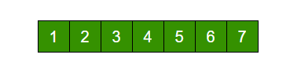
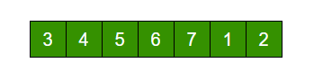
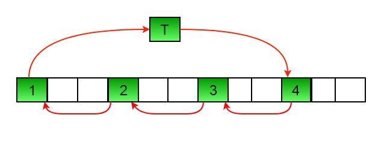

# Programs for array rotation

Write a function rotate(ar[], d, n) that rotates arr[] of size n by d elements.



Rotation of the above array by 2 will make array:



#### METHOD 1 (Using temp array):

```
Input arr[] = [1, 2, 3, 4, 5, 6, 7], d = 2, n =7
1) Store d elements in a temp array
   temp[] = [1, 2]
2) Shift rest of the arr[]
   arr[] = [3, 4, 5, 6, 7, 6, 7]
3) Store back the d elements
   arr[] = [3, 4, 5, 6, 7, 1, 2]
```
_**A solution:**_

```
/*
 * Rotation method 1 (Using temp array)
 * */
void array_rotate_method_one (int *array, int offset, int array_size)
{
        int temp[2];
        temp[0] = array[0];
        temp[1] = array[1];
        for (int i = 0; i < array_size; i++) {
                array[i] = array[i + offset];
        }
        array[array_size - 2] = temp[0];
        array[array_size - 1] = temp[1];
}
```


#### METHOD 2 (Rotate one by one):

```
leftRotate(arr[], d, n)
start
  For i = 0 to i < d
    Left rotate all elements of arr[] by one
end
```

To rotate by one, store arr[0] in a temporary variable temp, move arr[1] to arr[0], arr[2] to arr[1] …and finally temp 
to arr[n-1]

Let us take the same example arr[] = [1, 2, 3, 4, 5, 6, 7], d = 2

Rotate arr[] by one 2 times

We get [2, 3, 4, 5, 6, 7, 1] after first rotation and [ 3, 4, 5, 6, 7, 1, 2] after second rotation.

_**A solution:**_

```
/*
 * Rotation method 2 (Left rotate elements one by one)
 * */
void array_rotate_method_two (int *array, int offset, int array_size)
{
        for (int i = 0; i < offset; i++) {
                int temp = array[0];
                for (int j = 1; j < array_size; j++) {
                        array[j - 1] = array[j];
                }
                array[array_size - 2] = array[array_size - 1];
                array[array_size - 1] = temp;
        }
}
```

#### METHOD 3 (A Juggling Algorithm)

This is an extension of method 2. Instead of moving one by one, divide the array in different sets
where number of sets is equal to GCD of n and d and move the elements within sets.

If GCD is 1 as is for the above example array (n = 7 and d =2), then elements will be moved within one set 
only, we just start with `temp = arr[0]` and keep moving `arr[I+d]` to `arr[I]` and finally store temp at 
the right place.

Here is an example for n =12 and d = 3. GCD is 3.

```
Let arr[] be {1, 2, 3, 4, 5, 6, 7, 8, 9, 10, 11, 12}

a) Elements are first moved in first set: (See below)
```

```
ArrayRotation

          arr[] after this step --> {4 2 3 7 5 6 10 8 9 1 11 12}

b)    Then in second set.
          arr[] after this step --> {4 5 3 7 8 6 10 11 9 1 2 12}

c)    Finally in third set.
          arr[] after this step --> {4 5 6 7 8 9 10 11 12 1 2 3}
```

_**A solution:**_

```
/*
 * Rotation method 3 (Juggling algorithm)
 * */
void array_rotate_method_three (int *array, int k, int n)
{
        int tmp = 0;
        int s = gcd (k, n);
        int i = 0;
        int j = 0;
        int d = 0;
        for (i = 0; i < s; i++) {
                tmp = array[i];
                j = i;
                while (1) {
                        d = (j + k) % n;
                        if (d == i) {
                                break;
                        }
                        array[j] = array[d];
                        j = d;
                }
                array[j] = tmp;
        }
}
```

####Method 4 (The Reversal Algorithm) :

**_Algorithm :_**

    rotate(arr[], d, n)
        reverse(arr[], 1, d) ;
        reverse(arr[], d + 1, n);
        reverse(arr[], 1, n);

Let AB are the two parts of the input array where A = arr[0..d-1] and B = arr[d..n-1]. The idea of the algorithm is :

    Reverse A to get ArB, where Ar is reverse of A.
    Reverse B to get ArBr, where Br is reverse of B.
    Reverse all to get (ArBr) r = BA.

Example :
Let the array be arr[] = [1, 2, 3, 4, 5, 6, 7], d =2 and n = 7
A = [1, 2] and B = [3, 4, 5, 6, 7]

    Reverse A, we get ArB = [2, 1, 3, 4, 5, 6, 7]
    Reverse B, we get ArBr = [2, 1, 7, 6, 5, 4, 3]
    Reverse all, we get (ArBr)r = [3, 4, 5, 6, 7, 1, 2]

**_A solution:_**

```
/*
 * Rotation method 4 (Reversal algorithm)
 * */
void array_rotate_method_four (int *array, int offset, int array_size)
{
        reverse_array_subset (array, 0, 0 + offset);
        reverse_array_subset (array, offset, array_size);
        reverse_array_subset (array, 0, array_size);
}

/*
 * Reverse the elements of an array subset
 * */
void reverse_array_subset (int *array, int start, int end)
{
        int s = start;
        int e = end - 1;
        int tmp = 0;
        while (e > s) {
                tmp = array[s];
                array[s] = array[e];
                array[e] = tmp;
                s++;
                e--;
        }
}
```